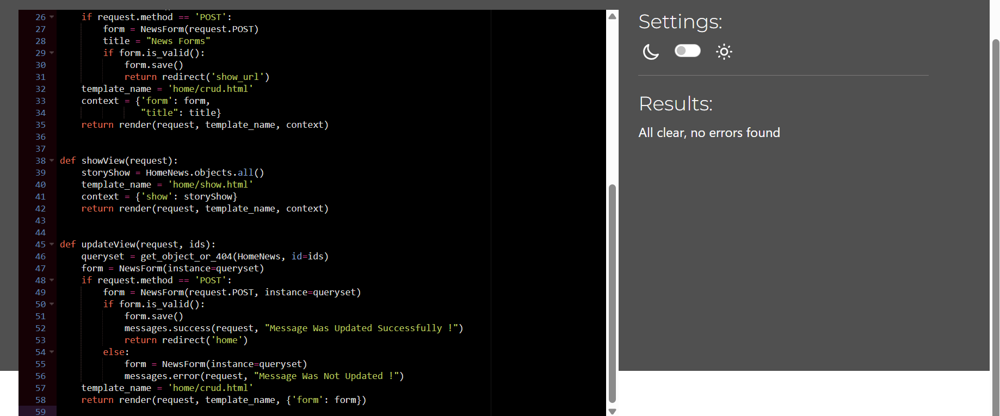

# Tests

## Manuel Testing

## HTML Validation

### Home Page
The only issue I had was the welcome message on the home page it was putting an extra P element 
but fixed issue quicky.

## Sign Up Page

the issues with page come from generated code from alluth/Django.
none of the errors come from my personal coding. 
1. unordered list in a span element is not allowed but generates as one 
2. A P element is not connecting to the other 

#### All Pages Tested
* Basket Page
* PT Sessions
* User Sessions
* Profile Page
* Payment Page
No issues where found when validating.

## CSS Validation
### styles .css

only had two errors at first one was object-fit:fit instead of contain.
the other one was I put sold instead of solid on a border.

### Custom Admin

Only found one issue and that was I tried to set a colour as none. so i deleted it 

## Java Script Validation

### Delete Exercise JS

### Delete Item JS

### Delete Main Exercise JS

### Stripe Element JS

## Python Validation
When doing the validations I made sure to take screen shots of a few for examples.
with all files except django generated ones, I also made sure they all conform to to Pep8 rules.

this is an example of what issues you will come across when doing Python validation with pep8 rules.

Here is the an example of a corrected version of the page.

Basket context file

Home page form file

Payment form file 

user program file

Basket view  file

# Light Room
I ran a light room test because its a good way to test the website in multiply ways in one test.

* Performance – Based on how fast the website loads and contributes to the overall UX.
* Accessibility – Based on how easy it is to use the website regardless if people might use a screen reader, etc.
* Best Practices – Based on the best practices used in industry.
* SEO Performance – Based on how useful the meta tags and labels are throughout the website.

# Manuel Testing
The testing methods I did were pretending to be a customer and using the app as a staff member to.
this involves going through all the links and pages making programs and deleting them also making orders and making sure they are accessible by the client when brought.

I also sent a live version to a few friends to test it out and give reviews on it.

## Home
There is only two features to test on this page 
1. super users are the only ones that can see the update button
2. the update button takes you to a page that lets you update
### Update Button Test

Non super user view

### Updating The Message

The button is visible in super user mode.

Link on the button dose take you to the update page and allows you to added and take away text.

Pressed the update button takes you back to home page and has updated text.
## Payments Tests
Payment test involves making sure all the buttons and links go to the right page, all forms are fill able and will let the user continue on to the payment and then check that the payment goes through the stripe payment system correctly.
1. 
when doing this I tested to see if they are all required.
if the email can be skipped by not adding the @ and it stops you.

2. 
this checks if the card is valid and has a build in save function.
if you don't put in the right number it will say and give a red warning.
3. 
this redirects you to a success page or if it fails it will have a warning pop up on the screen.
4. 
this is were i checked if the webhooks were working and if the card is failing.
5. 
if everything goes well you will reach this page.

## User Sessions
The user Sessions Tests I will Be doing
1. Making sure the link to the page works
2. make sure page displays 
3. make sure the user can make a session 
4. if you can make a session the next will be can you use the link to get to the adding exercise page 
5. when on the adding exercise page i will test if you can add new exercises , update them and delete them.

### Making Session & Deleting Test
the testing of the sessions was easy because it was only create and delete so only two buttons
* testing the create scroll down and fill in the form and then press the add new button and an alert will show saying it was created and it will show on the page.

* testing the delete click the delete button and then you will get a warning saying are you sure and when you click the delete, it deleted the session and an alert will show.

### Making Exercise , Delete & Update
#### Making A New Exercise
The Tests I did to make sure that Crud functionality is working in this part I also tested to make sure
the alerts were working with every test

The link to the page works and the page displays fully

next step was to check if i could add a new exercise so i scrolled down to the form.

the last step was click the button make and then you will get an alert and then the new exercise was made.
#### Updating
when testing the update function I looked out for alerts and if it was successful 

first I clicked the update button and then it took me to the update page and changed a few things to 
check if the texts can be changed

the final step is click the update button and then it shows an alert. the new exercise appeared as a table on the grid.
#### Deleting
testing the delete button was the easiest because all i had to do is click and see what happens.

first step click on the delete button.

no warning shows but an alert shows up and the exercise is deleted.

## PT Sessions
Testing the Pt session includes
1. making sure the admin button appears only for super users
2. items can be brought by users logged in
3. when on the super user page they only have access to the pt sessions
4. final but big test is to check that i can create a pt session and it appear on the pt session page.
### Staff/Personal Trainers options

the Staff/Personal Trainers will all have access to a restricted version of the admin page.

this shows that the admin button is not showing means that it has passed this test.
### Staff/Personal Trainer Page
the styles on this page is very basic because the customers wont be able to view it so all it needs to be is functional and thats what this image blow shows:

this gives staff the option to make programs up and if they know html they can us that to make a more
advanced looking program.
### Making A PT Session
1. First check the link works.
2. no other pt sessions are appearing from other pt's

this shows that the admin has given the right access.
Making a new session in the menu the link works and the view is limited to only session made by the current user logged in

next i filled out the form and check all the required and tested what clients can add the session to.

now to check if the session will be added after I confirm the form.

The next check is to make sure its on the market place and adding to basket works too.

the last check is to see if you can view the session from you profile where it is stored

# Issues
### Static Files Not Working
1. the first issue i has was getting the static files to work on the deployed version. 
is would have the bootstrap styles but no css, js or media I had made. 
* Solution
I forgot to download and set up whitenoise to the middle ware   

MIDDLEWARE = [
    'django.middleware.security.SecurityMiddleware',
#   'whitenoise.middleware.WhiteNoiseMiddleware', 
    'django.contrib.sessions.middleware.SessionMiddleware',
    'django.middleware.common.CommonMiddleware',
    'django.middleware.csrf.CsrfViewMiddleware',
    'django.contrib.auth.middleware.AuthenticationMiddleware',
    'django.contrib.messages.middleware.MessageMiddleware',
    'django.middleware.clickjacking.XFrameOptionsMiddleware',
    "allauth.account.middleware.AccountMiddleware",
]

2. update / edit the new story
*  I had an issue with getting the news story to update so i had to do some research and the problem was i had the urls set up wrong so it was using the wrong views function

>Urls.py
path('sv/', views.showView, name='show_url'),

>views.py

def updateView(request, ids):
    queryset =  get_object_or_404 (HomeNews, id=ids)
    form = NewsForm(instance=queryset)
    if request.method == 'POST':
        form = NewsForm(request.POST, instance=queryset)
        if form.is_valid():
            form.save()
#            return redirect('home')
        else:
            form = NewsForm(instance=queryset)
    template_name = 'home/crud.html'
    return render(request, template_name, {'form':form})

instead of having the redirect to home it was using the show View one and this confused me going through and wondering why the form didn't appear

### Potential Issue 
while testing this the only issue I can think of is that you can add anyone as the user, but this will be counted because all members of staff will be trained to use this and if they select the wrong person we have an admin team to fix the issue.
# Issues / Bugs
## User Sessions
this issues has been the hardest one so far the image below shows the debugging i was using the console logs where my best friend.

I realised the for loop wasn't correct on the HTML.

this is the change I had to do to make sure it worked 

this shows that it wasn't collecting to delete number to add to the URL.

## Basket
The primary issue encountered was that the basket would not delete a product but instead set its quantity to 0. Solution: The problem was identified in the view, where the default value was set to 0 instead of 1, preventing the item from being removed.

when trying to debug i couldn't understand why it wasn't adding anything but!!!

then i was reviewing the walkthrough i saw they have the "+= 1" and thought, that makes sense how can you add nothing to nothing and then boom it worked.

## Payment
1. 

the main issues i had was the web hooks not working properly.

this was done when making this part of the readme.
2. 

this is the second issue that I had this isn't a big issue but it dose not stick to the norm.

## Reviews