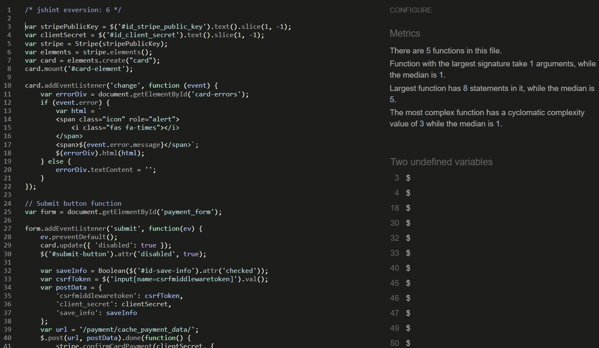

# Tests

## Manual Testing

## HTML Validation

### Home Page
The only issue I encountered was an extra <p> element being added to the welcome message on the home page. I was able to resolve this issue quickly.

## Sign Up Page


The issues on the page originate from code generated by Allauth/Django. None of the errors are a result of my personal coding.
1. unordered list in a span element is not allowed but generates as one 
2. A P element is not connecting to the other 

#### All Pages Tested
* Basket Page
* PT Sessions
* User Sessions
* Profile Page
* Payment Page
* Sign up
* Email Registration
No other issues where found when validating.

## CSS Validation
### styles .css

I initially encountered two errors. The first was using object-fit: fit instead of contain. The second was a typo where I wrote sold instead of solid for a border property.

### Custom Admin

I identified a single issue: an attempt to set a color value to ‘none’. This was resolved by removing the erroneous setting.

## Java Script Validation
“I included the directive ```/* jshint esversion: 6 */``` at the beginning of the script to ensure compatibility with ES6 syntax.

### Delete Exercise JS


### Delete Item JS


### Delete Main Exercise JS


### Stripe Element JS


#### Comments
The warning you’re encountering pertains to potential issues with functions declared within loops, which can occasionally result in unexpected behavior due to JavaScript’s handling of variable scope and closures. In this instance, the myModal variable is referenced within the loop but remains unmodified, thus it should not pose any issues.

Additionally, all variables that are returning as undefined are sourced externally.

## Python Validation
During the validation process, I ensured to capture screenshots of several examples. Additionally, I verified that all files, except those generated by Django, conform to PEP 8 standards.

this is an example of what issues you will come across when doing Python validation with pep8 rules.

Here is the an example of a corrected version of the page.

Basket context file

Home page form file

Payment form file 

user program file

Basket view  file

# Light Room
I conducted a Lighthouse test as it provides a comprehensive evaluation of the website’s performance across multiple metrics in a single test.

* Performance – Evaluated based on the website’s loading speed and its impact on the overall user experience (UX).
* Accessibility – Based on how easy it is to use the website, including for users who might rely on screen readers or other assistive technologies
* Best Practices – Based on industry standards and best practices.
* SEO Performance – Based on the effectiveness of the meta tags and labels throughout the website, my site requires some performance rating improvements, which I plan to implement in the future.


# Manual Testing
The testing methods I employed included simulating both customer and staff member roles. This involved navigating through all links and pages, creating and deleting programs, and placing orders to ensure they were accessible to clients upon purchase.

Additionally, I shared a live version with a few friends for testing and feedback.

## Home
There are only few features to test on this page, along with all the links in the navigation bar and the footer.
1. Verify the functionality of all navigation bar links.
2. Ensure the Mailchimp integration is operational and that submitting an email through the form works
    correctly.
    - Additionally, confirm that the email validation checks for the presence of an “@” symbol.
3. Review the links to external sites and the privacy policy for accuracy and functionality.
    - Also make sure that all links open in a new tab.
4. Only super users can see the update button.
5. The update button redirects you to a page where you can make updates.
### Update Button Test


Non-super user view.


### Updating The Message

The button is visible in super user mode.


The link on the button successfully navigates to the update page, allowing you to add and remove text.


Pressing the update button redirects you to the home page and displays the updated text.

## Payments Tests
The payment test involves ensuring that all buttons and links navigate to the correct pages, all forms are fillable, and the user can proceed to the payment stage. Additionally, it verifies that the payment is processed correctly through the Stripe payment system.
1. 
While testing, I verified that all fields are required. Specifically, I checked if the email field could be bypassed by omitting the ‘@’ symbol, and confirmed that the system prevents this by displaying an error message.

2. 
This checks if the card is valid and includes a built-in save function. If you enter an incorrect number, a red warning message will appear.
3. 
This will redirect you to a success page. If it fails, a warning will pop up on the screen.
4. 
This is where I checked if the webhooks were functioning correctly and if the card was failing.
5. 
If everything goes well, you will reach this page.

## User Sessions
The user session tests I will be conducting include the following
1. Verify that the link to the page is functional.
2. Ensure that the page displays correctly.
3. Ensure that the user can successfully create a session.
4. After successfully creating a session, the next step is to use the link to navigate to the ‘Add Exercise’ page.
5. On the ‘Add Exercise’ page, I will test the functionality to add new exercises, update existing ones, and delete them.

### Making Session & Deleting Test
Testing the sessions was straightforward, as it involved only two actions: create and delete, each corresponding to a single button.

* To test the create functionality, scroll down and complete the form. Then, press the ‘Add New’ button. An alert will appear confirming the creation, and the new entry will be displayed on the page.

* To test the delete functionality, click the delete button. A warning message will appear asking for confirmation. Upon confirming, the session will be deleted, and an alert will be displayed.


### Making Exercise , Delete & Update
#### Making A New Exercise
I conducted tests to ensure the CRUD functionality was operational in this section. Additionally, I verified that the alerts were triggered correctly with each test.


The link to the page is functional, and the content displays completely.


The subsequent step involved verifying the possibility of adding a new exercise, which I accomplished by navigating to the form located further down the page


The final step was to click the “Make” button, which triggered an alert, confirming that the new exercise was successfully created.
#### Updating
When testing the update function, I monitored for alerts and verified if the update was successful.


First, I clicked the update button, which redirected me to the update page. I then modified a few elements to verify if the text could be changed.


The final step is to click the update button, which triggers an alert. The new exercise then appears as a table on the grid.
#### Deleting
Testing the delete button was straightforward; I simply clicked it to observe the outcome.


The first step is to click on the delete button.


No warning is displayed, but an alert appears, and the exercise is successfully deleted.

## PT Sessions
Testing the Pt session includes
1. Ensuring that the admin button is visible only to super users.
2. Items can be purchased by logged-in users.
3. When on the super user page, access is restricted to personal training sessions only.
4. The final and most significant test is to verify that I can create a personal training session and ensure it appears on the PT session page.
### Staff/Personal Trainers options

Staff and Personal Trainers will have access to a restricted version of the admin page.

This confirms that the absence of the admin button indicates the test has been successfully passed.
### Staff/Personal Trainer Page
The styles on this page are intentionally basic, as customers will not be able to view it. The primary focus is on functionality, as demonstrated in the image below:

This feature allows staff to create programs, and those with HTML knowledge can design more advanced and visually appealing programs.
### Making A PT Session
1. First check the link works.
2. No other personal training sessions from other trainers are appearing

This confirms that the admin has granted the correct access permissions. When creating a new session from the menu, the link functions correctly, and the view is restricted to sessions created by the currently logged-in user.

Next, I filled out the form, ensuring all required fields were completed. I then tested to confirm that clients could successfully add the session.

The next step is to verify if the session is added after confirming the form.


The next step is to ensure that the product is listed on the marketplace and that the “add to basket” functionality is working correctly.

The final step is to verify if the session can be viewed from your profile where it is stored. 


# Issues
### Static Files Not Working
1. the first issue i has was getting the static files to work on the deployed version. 
is would have the bootstrap styles but no css, js or media I had made. 
* Solution
I forgot to download and set up whitenoise to the middle ware   

MIDDLEWARE = [
    'django.middleware.security.SecurityMiddleware',
#   'whitenoise.middleware.WhiteNoiseMiddleware', 
    'django.contrib.sessions.middleware.SessionMiddleware',
    'django.middleware.common.CommonMiddleware',
    'django.middleware.csrf.CsrfViewMiddleware',
    'django.contrib.auth.middleware.AuthenticationMiddleware',
    'django.contrib.messages.middleware.MessageMiddleware',
    'django.middleware.clickjacking.XFrameOptionsMiddleware',
    "allauth.account.middleware.AccountMiddleware",
]

2. update / edit the new story
*  I encountered an issue with updating the news story. After conducting some research, I discovered that the problem was due to incorrect URL configurations, which resulted in the use of the wrong views function.

>Urls.py
```
path('sv/', views.showView, name='show_url'),
```
>views.py
```
def updateView(request, ids):
    queryset =  get_object_or_404 (HomeNews, id=ids)
    form = NewsForm(instance=queryset)
    if request.method == 'POST':
        form = NewsForm(request.POST, instance=queryset)
        if form.is_valid():
            form.save()
#            return redirect('home')
        else:
            form = NewsForm(instance=queryset)
    template_name = 'home/crud.html'
    return render(request, template_name, {'form':form})
```
instead of having the redirect to home it was using the show View one and this confused me going through and wondering why the form didn't appear

### Potential Issue 
During testing, the only issue identified was the potential to add any user. However, this will be managed as all staff members will receive training on proper usage. In the event of an incorrect selection, our admin team will be available to rectify the issue.

# Issues / Bugs
## User Sessions

This issue has been the most challenging so far. The image below illustrates the debugging process, where console logs proved to be invaluable.

I realised the for loop wasn't correct on the HTML.

this is the change I had to do to make sure it worked 

this shows that it wasn't collecting to delete number to add to the URL.


## Basket
The primary issue encountered was that the basket would not delete a product but instead set its quantity to 0. The solution involved identifying the problem in the view, where the default value was set to 0 instead of 1, which prevented the item from being removed.

When trying to debug i couldn't understand why it wasn't adding anything but!!!

Then i was reviewing the walkthrough i saw they have the "+= 1" and thought, that makes sense how can you add nothing to nothing and then boom it worked.

## Payment
1. 

The primary issue I encountered was that the webhooks were not functioning correctly.

this was done when making this part of the readme.
2. 

this is the second issue that I had this isn't a big issue but it dose not stick to the norm.

# Reviews

# First Review

All issues that the user has shown I have fixed.