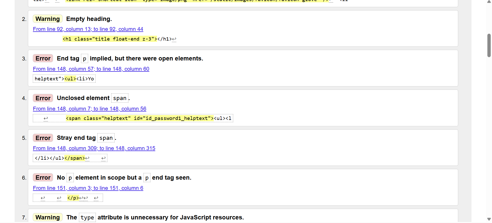

# Tests

## Manuel Testing

## HTML Validation

### Home Page

The only issue I had was the welcome message on the home page it was putting an extra P element 

### Basket Page

No issues where found only a couple of warnings

## Sign Up Page

the issues with page come from generated code from alluth/Django. 
1. unordered list in a span element is not allowed but generates as one 
2. A P element is not connecting to the other 

## PT Sessions

I had no issues with this only a couple of warnings.

I had no issues with this only a couple of warnings.

## User Sessions

I had no issues with this only a couple of warnings.

## Profile Page

## Payment Page

## CSS Validation

### styles .css

only had two errors at first one was object-fit:fit instead of contain.
the other one was I put sold instead of solid on a border.

### Custom Admin

Only found one issue and that was I tried to set a colour as none. so i deleted it 

## Java Script Validation

### Delete Exercise JS

### Delete Item JS

### Delete Main Exercise JS

### Stripe Element JS

## Python Validation
When doing the validations I made sure to take screen shots of a few for examples.
with all files except django generated ones, I also made sure they all conform to to Pep8 rules.

this is an example of what issues you will come across when doing Python validation with pep8 rules.

Here is the an example of a corrected version of the page.

Basket context file

Home page form file

Payment form file 

user program file

Basket view  file

# Light Room

# Manuel Testing
The testing methods I did were pretending to be a customer and using the app as a staff member to.
this involves going through all the links and pages making programs and deleting them also making orders and making sure they are accessible by the client when brought.

I also sent a live version to a few friends to test it out and give reviews on it.

## Home
There is only two features to test on this page 
1. super users are the only ones that can see the update button
2. the update button takes you to a page that lets you update
### Update Button Test

Non super user view

### Updating The Message

The button is visible in super user mode.

Link on the button dose take you to the update page and allows you to added and take away text.

Pressed the update button takes you back to home page and has updated text.
## Payments Tests
Payment test involves making sure all the buttons and links go to the right page, all forms are fill able and will let the user continue on to the payment and then check that the payment goes through the stripe payment system correctly.
1. 
when doing this I tested to see if they are all required.
if the email can be skipped by not adding the @ and it stops you.

2. 
this checks if the card is valid and has a build in save function.
if you don't put in the right number it will say and give a red warning.
3. 
this redirects you to a success page or if it fails it will have a warning pop up on the screen.
4. 
this is were i checked if the webhooks were working and if the card is failing.
5. 
if everything goes well you will reach this page.

## User Sessions
The user Sessions Tests I will Be doing
1. Making sure the link to the page works
2. make sure page displays 
3. make sure the user can make a session 
4. if you can make a session the next will be can you use the link to get to the adding exercise page 
5. when on the adding exercise page i will test if you can add new exercises , update them and delete them.
### Making Session & Deleting Test

### Making Exercise , Delete & Update
#### Making A New Exercise

#### Updating

#### Deleting 

## PT Sessions
## Reviews