Welcome Aaron storey,

This is the Code Institute student template for Gitpod. We have preinstalled all of the tools you need to get started. It's perfectly ok to use this template as the basis for your project submissions.

You can safely delete this README.md file or change it for your own project. Please do read it at least once, though! It contains some important information about Gitpod and the extensions we use. Some of this information has been updated since the video content was created. The last update to this file was: **May 28, 2024**

## Gitpod Reminders

To run a frontend (HTML, CSS, Javascript only) application in Gitpod, in the terminal, type:

`python3 -m http.server`

A blue button should appear to click: _Make Public_,

Another blue button should appear to click: _Open Browser_.

To run a backend Python file, type `python3 app.py` if your Python file is named `app.py`, of course.

A blue button should appear to click: _Make Public_,

Another blue button should appear to click: _Open Browser_.

By Default, Gitpod gives you superuser security privileges. Therefore, you do not need to use the `sudo` (superuser do) command in the bash terminal in any of the lessons.

To log into the Heroku toolbelt CLI:

1. Log in to your Heroku account and go to *Account Settings* in the menu under your avatar.
2. Scroll down to the *API Key* and click *Reveal*
3. Copy the key
4. In Gitpod, from the terminal, run `heroku_config`
5. Paste in your API key when asked

You can now use the `heroku` CLI program - try running `heroku apps` to confirm it works. This API key is unique and private to you, so do not share it. If you accidentally make it public, you can create a new one with _Regenerate API Key_.

------

## Release History

We continually tweak and adjust this template to help give you the best experience. Here is the version history:

**May 28 2024:** Fix Mongo and Links installs

**April 26 2024:** Update node version to 16

**September 20 2023:** Update Python version to 3.9.17.

**September 1 2021:** Remove `PGHOSTADDR` environment variable.

**July 19 2021:** Remove `font_fix` script now that the terminal font issue is fixed.

**July 2 2021:** Remove extensions that are not available in Open VSX.

**June 30 2021:** Combined the P4 and P5 templates into one file, added the uptime script. See the FAQ at the end of this file.

**June 10 2021:** Added: `font_fix` script and alias to fix the Terminal font issue

**May 10 2021:** Added `heroku_config` script to allow Heroku API key to be stored as an environment variable.

**April 7 2021:** Upgraded the template for VS Code instead of Theia.

**October 21 2020:** Versions of the HTMLHint, Prettier, Bootstrap4 CDN and Auto Close extensions updated. The Python extension needs to stay the same version for now.

**October 08 2020:** Additional large Gitpod files (`core.mongo*` and `core.python*`) are now hidden in the Explorer, and have been added to the `.gitignore` by default.

**September 22 2020:** Gitpod occasionally creates large `core.Microsoft` files. These are now hidden in the Explorer. A `.gitignore` file has been created to make sure these files will not be committed, along with other common files.

**April 16 2020:** The template now automatically installs MySQL instead of relying on the Gitpod MySQL image. The message about a Python linter not being installed has been dealt with, and the set-up files are now hidden in the Gitpod file explorer.

**April 13 2020:** Added the _Prettier_ code beautifier extension instead of the code formatter built-in to Gitpod.

**February 2020:** The initialisation files now _do not_ auto-delete. They will remain in your project. You can safely ignore them. They just make sure that your workspace is configured correctly each time you open it. It will also prevent the Gitpod configuration popup from appearing.

**December 2019:** Added Eventyret's Bootstrap 4 extension. Type `!bscdn` in a HTML file to add the Bootstrap boilerplate. Check out the <a href="https://github.com/Eventyret/vscode-bcdn" target="_blank">README.md file at the official repo</a> for more options.

------

## FAQ about the uptime script

**Why have you added this script?**

It will help us to calculate how many running workspaces there are at any one time, which greatly helps us with cost and capacity planning. It will help us decide on the future direction of our cloud-based IDE strategy.

**How will this affect me?**

For everyday usage of Gitpod, it doesn’t have any effect at all. The script only captures the following data:

- An ID that is randomly generated each time the workspace is started.
- The current date and time
- The workspace status of “started” or “running”, which is sent every 5 minutes.

It is not possible for us or anyone else to trace the random ID back to an individual, and no personal data is being captured. It will not slow down the workspace or affect your work.

**So….?**

We want to tell you this so that we are being completely transparent about the data we collect and what we do with it.

**Can I opt out?**

Yes, you can. Since no personally identifiable information is being captured, we'd appreciate it if you let the script run; however if you are unhappy with the idea, simply run the following commands from the terminal window after creating the workspace, and this will remove the uptime script:

```
pkill uptime.sh
rm .vscode/uptime.sh
```

**Anything more?**

Yes! We'd strongly encourage you to look at the source code of the `uptime.sh` file so that you know what it's doing. As future software developers, it will be great practice to see how these shell scripts work.

---

Happy coding!


# Home Page

### Brief description
the home page is aimed to welcome new people to the app/site so they understand what we as the developers can provide the user.

### Plans
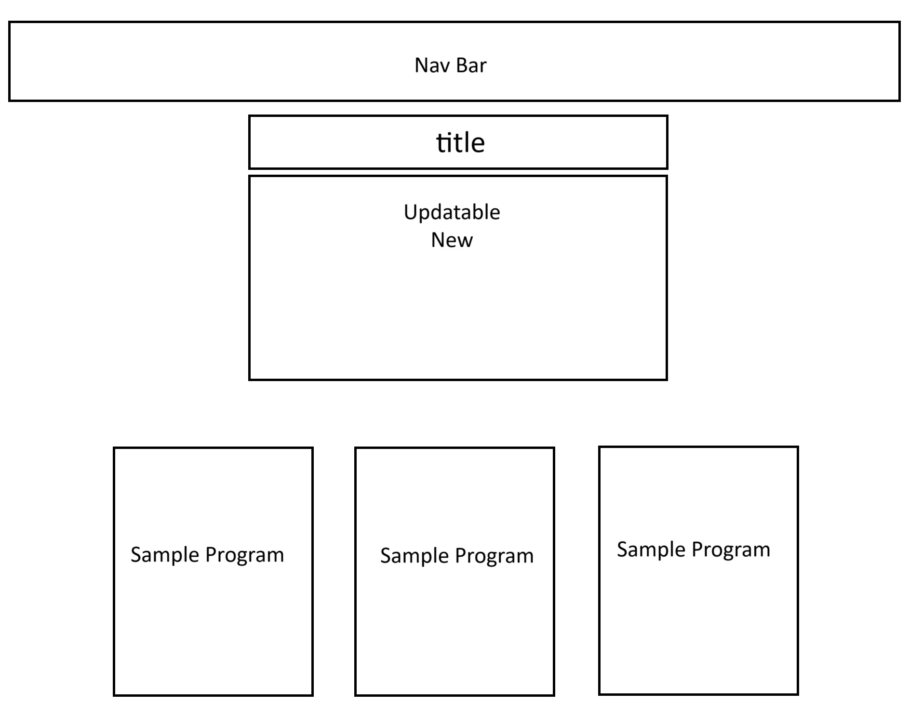
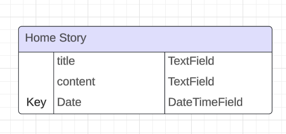

### Thoughts 
this is a basic model i set up thinking that it would be nice to be able to edit for super users but i thought if i keep it to only one and make it so only devs and the client can change.

i also made it so its crud function is only to be updated so its easy to track and make sure not to much writing is on the home.

# issues
1. the first issue i has was getting the static files to work on the deployed version. 
is would have the bootstrap styles but no css, js or media I had made. 
* Solution
I forgot to download and set up whitenoise to the middle ware   

MIDDLEWARE = [
    'django.middleware.security.SecurityMiddleware',
#   'whitenoise.middleware.WhiteNoiseMiddleware', 
    'django.contrib.sessions.middleware.SessionMiddleware',
    'django.middleware.common.CommonMiddleware',
    'django.middleware.csrf.CsrfViewMiddleware',
    'django.contrib.auth.middleware.AuthenticationMiddleware',
    'django.contrib.messages.middleware.MessageMiddleware',
    'django.middleware.clickjacking.XFrameOptionsMiddleware',
    "allauth.account.middleware.AccountMiddleware",
]

2. update / edit the new story
*  I had an issue with getting the news story to upadate so i had to do some research and the problem was i had the urls set up wrong so it was using the wrong views function

>Urls.py
path('sv/', views.showView, name='show_url'),

>views.py

def updateView(request, ids):
    queryset =  get_object_or_404 (HomeNews, id=ids)
    form = NewsForm(instance=queryset)
    if request.method == 'POST':
        form = NewsForm(request.POST, instance=queryset)
        if form.is_valid():
            form.save()
#            return redirect('home')
        else:
            form = NewsForm(instance=queryset)
    template_name = 'home/crud.html'
    return render(request, template_name, {'form':form})

instead of having the redirect to home it was using the show View one and this confused me going through and wondering why the form didn't appear

# User Sessions
### js issues
this issues has been the hardest one so far the image below shows the debugging i was using the console logs where my best friend.
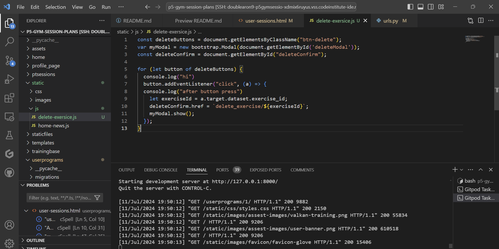
I realised the for loop wasn't correct on the html.
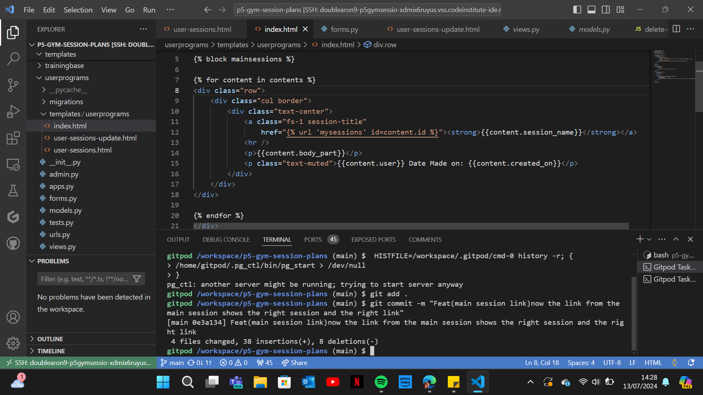
this is the change i had to do to make sure it worked 

this shows that it wasn't collecting the delete number to add to the url.
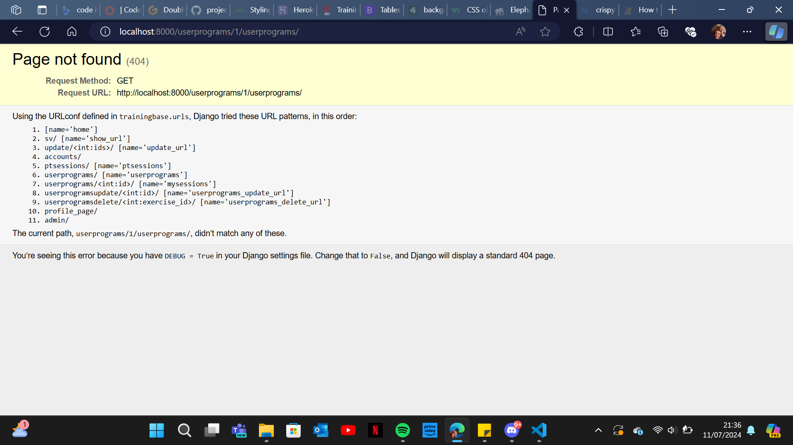

### Brief description
the aim for this page was so that customers can make up there own sessions and record what they have done.

### Plans

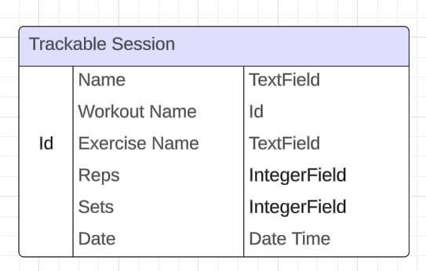

### Thoughts 
when making this i spent a long time trying to get the crud function to work on the exercise part because the urls and the java script just weren't working together well but its a great learning curve and will increase my skills by a lot.
### Test
The Tests i did manually : 
1. add new program
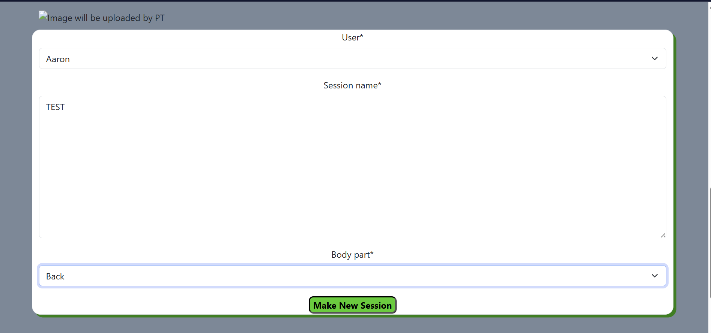
Session Added
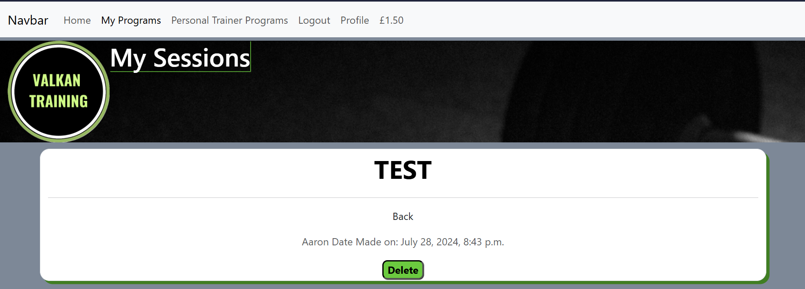
2. View Full Session
this view shows that the link on the session open up to the exercise page
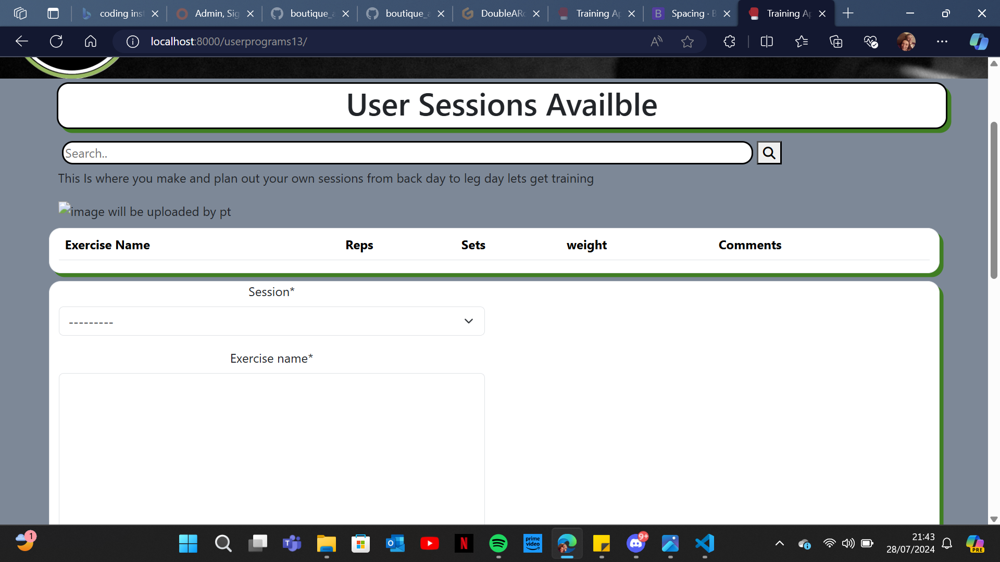
3. add Exercises 
This image shows the form to add a program to the exercise page 

4. Edit Session
this shows the editing form for the exercise and auto fills with the old information.
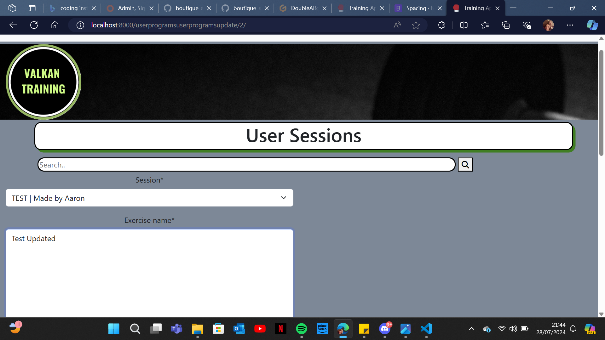
this shows that after editing it dose update the exercise.
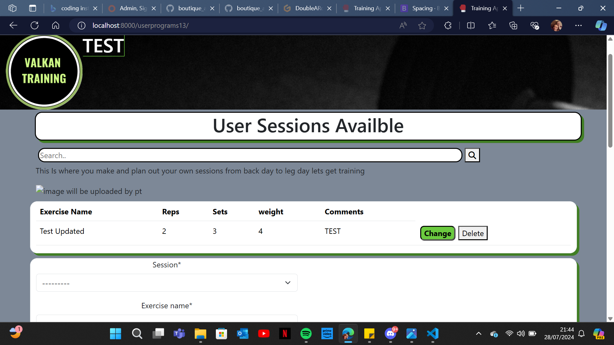
5. Delete Exercise


# Pt sessions
### Brief description
This app is for the Pts/admins so they can sell their training sessions and maintain the updates for the clients so they will always have new sessions and learn new ways to try all the time.
### issues
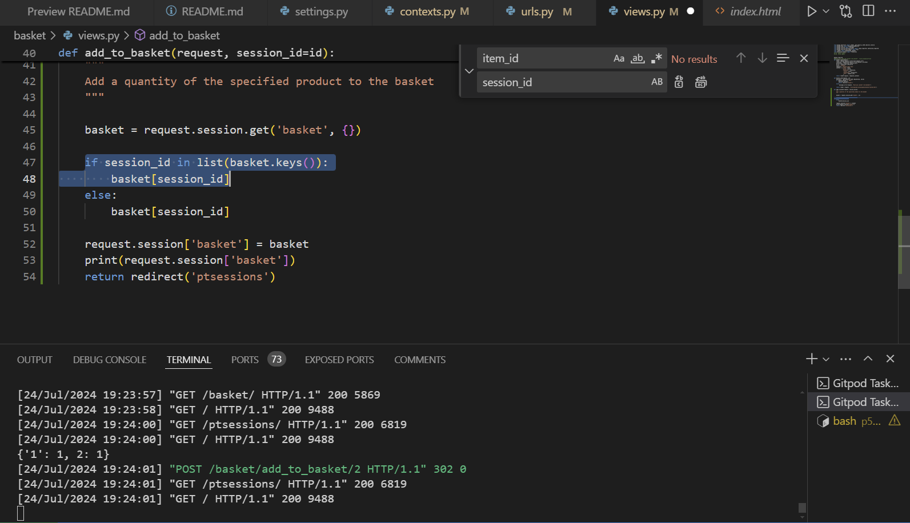
when trying to debug i couldn't understand why it wasn't adding anything but!!!
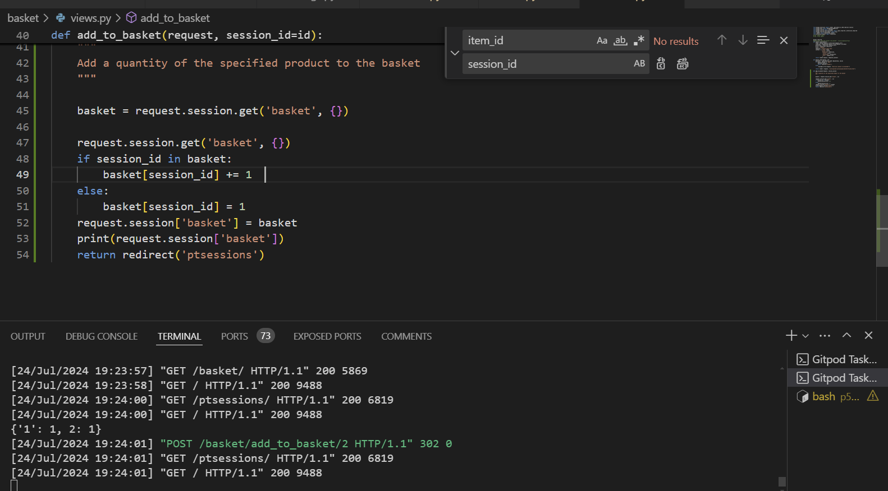
then i was reviewing the walkthrough i saw they have the "+= 1" and thought, that makes sense how can you add nothing to nothing and then boom it worked.
### Testing
The Tests i did where 
1. Add Item To Basket
2. Test Link to the full Session Page

# Basket
### Brief description
this app is designed to be for all clients looking to by any sessions the PT/Admins make. it also only keeps the clients items when they keep the page open.
### issues
### Testing

# Payments
### Brief description
this app is to help integrate stripe and make it easier for the users to know exactly what items they are buying 
### issues
### Testing

### Key Words

## main subjects

* Gym Sessions
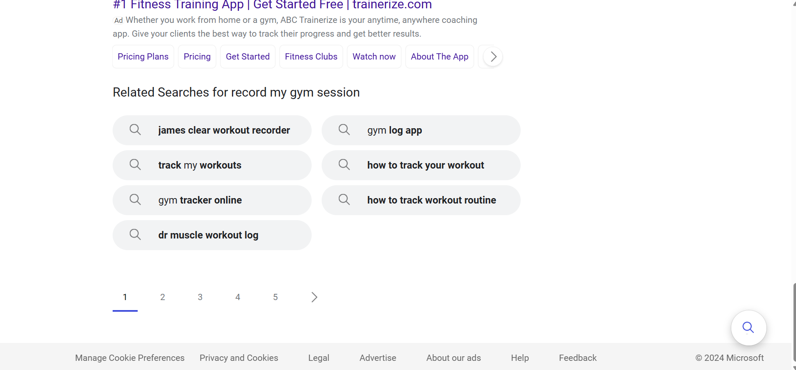

* Programs 
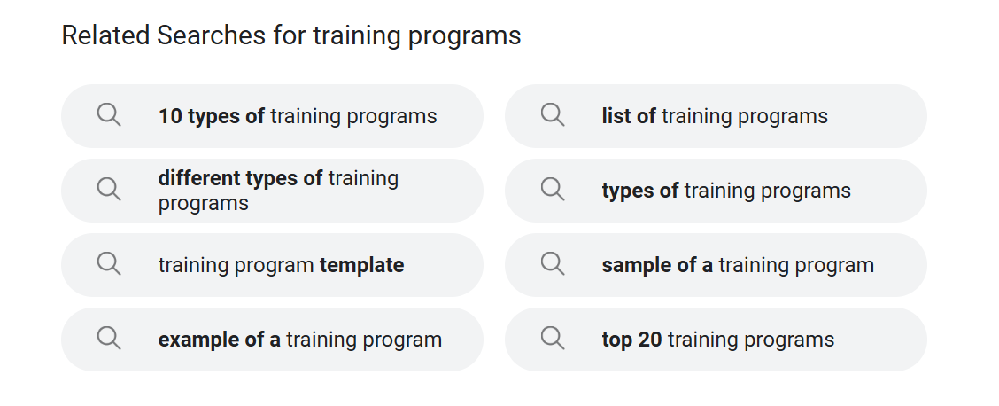

* Training
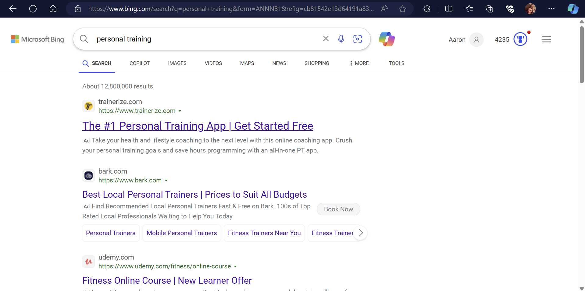

## Short Tail Key Words:
~ Fitness ~
Training 
~ Muscles ~
Exercises
Personal Training
~ Chest ~
~ Back ~
~ Legs ~
~ Biceps ~
~ Triceps ~
~ Full Body ~
Hit Training
Health
Goals
Sessions
weight loss
cutting weight
~ lose weight ~
~gym~ 

Long tail Key Words:

~Personal Training Sessions~
Custom-made sessions and free recording of sessions
many Different styles of training e.g Hit, Full Body and Steady State
Sessions for any needs or goals 
~buy personal training sessions~
record my gym program


## All Key Words That Will Be On The Site:

Custom-made sessions and free recording of sessions
many Different styles of training e.g Hit, Full Body and Steady State
Sessions for any needs or goals 
Record My Gym Program
Hit Training
Health
Goals
Sessions
weight loss
cutting weight
Exercises
Personal Training

# Facebook Page


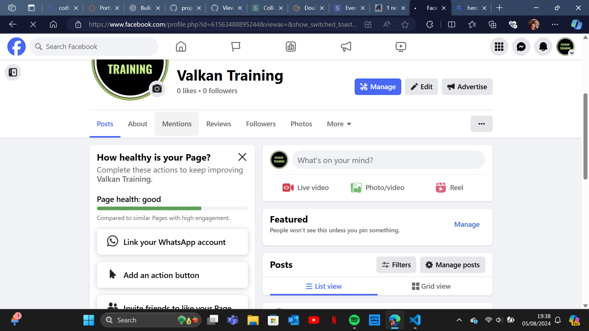

### Why Use Facebook

Facebook is an amazing site to get free and paid avertisement. Facebook also has great instagram integration so you can boost on face book as well as instagram,whats app and share links on other social media site.