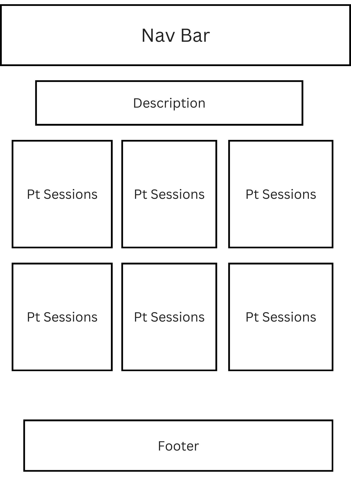
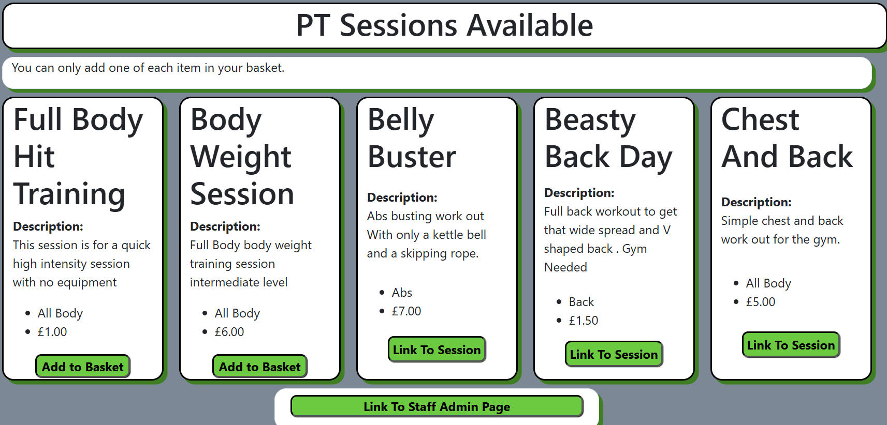

# Welcome To Valkan Fitness


Link To Website
[live site](https://lets-get-fit-0b60a4063b7b.herokuapp.com/)


# Introduction
This project originated from an idea I have nurtured for some time. Now, with the skills acquired through my studies at a coding institute, I am equipped to bring it to fruition.

The project is designed for individuals who are beginning their fitness journey and wish to learn more about fitness. My goal is to provide a straightforward and user-friendly platform for recording training sessions. Additionally, it will enable personal trainers to sell their programs to clients and facilitate easy access to pre-planned sessions by qualified trainers.

## Stripe Test Integration

This project is in test mode, so no real money will be transferred.

# Marketing Plans
The Plans I have put in place are
- Free Advisement on Social Media:
    - This will be conducted through Facebook, leveraging the company page that has been set up. Facebook’s integrations with other social media platforms provide extensive reach, allowing us to effectively showcase our offerings to a broad audience of potential users.
- YouTube and TikTok Ads:
    - These platforms have been selected for paid advertising due to their substantial daily traffic, providing an excellent opportunity to reach a wide audience.
- Paid Ads and Posts:
    - Utilizing Instagram for paid advertisements and posts will significantly enhance brand visibility due to the platform’s high traffic. Additionally, the presence of numerous fitness influencers on Instagram presents opportunities for potential collaborations and promotions, further boosting the company’s reach.

# Scope

## UX-User Experience Design
The design inspiration stems from the Xbox colour scheme, particularly the newer models, which feature a darker base colour complemented by a subtle glow reminiscent of the power button.

To enhance the user experience, I focused on creating a clean and straightforward design. This approach ensures that the app is not cluttered with excessive images, links, or features on a single page, thereby providing a seamless and enjoyable user experience.

The UX can be broken down into
* The Strategy Plane
* The Scope Plane
* The Structure Plane
* The Skeleton Plane
* The Surface Plane

## Strategy Plane
As the creator, my objectives for the site are as follows:

* Ensure the site is easy to navigate.
* Enable users to record their gym sessions.
* Provide users with alerts when they perform actions on the site.
* Allow staff to add, edit, and delete personal training sessions.

### User Stories


Client Side User Stories:

* As a site user, I want the site to be inviting and simple to use.
* As a site user, I want to be able to navigate across the site, so that I can view different pages on the site.
* As a site user, I want to be able to sign up, so that I can have a personal account on the site.
* As a site user, I want to receive an email confirmation after registering.
Customer Client Stories:

* As a client, I want to view all products, so that I can decide what I want to buy.
* As a client, I want to record my sessions to track my progress.
* As a client, I want to see a confirmation page and have the product appear in my account.
* As a client, I want to view my basket, so that I can see what is in it and adjust quantities.

### The Scope Plane
The features I initially envisioned for this project couldn’t be fully implemented within the planned time frame. However, I was able to develop a functional site with the core components of the plan.

My plan includes a phased deployment approach.

#### Phase 1
* Develop a project that meets the outlined user stories.
* Create a Home Page with an introduction.
* Implement a Navbar to facilitate navigation across different pages.
* Design a Products page to showcase all sessions offered by personal trainers.
* Integrate e-commerce functionality to enable users to make purchases.

#### Phase 2
Enhance the Phase 1 project by incorporating additional features:

* Develop a functional Profile app that enables users to have accounts linked to their purchases and created programs.
* Allow users to build their own fitness programs.
#### Phase 3
Focus on user feedback:

* Collect and review feedback to identify areas for improvement.

## The Structure Plane
#008000


I selected this shade of green because it closely resembles the Xbox console’s power-on colour. Additionally, when combined with a box shadow, it creates an appealing glow effect.

#778899


I selected this shade of grey because it is bright enough to provide the perfect contrast with the other colours, thereby enhancing their visibility and making them stand out.

#fff


I selected this shade of white to ensure that the text stands out clearly, making it easy to read.

#### Fonts - Verdana

I selected Verdana as the font for this project due to its readability and simplicity. Given that the project is not text-heavy, I opted to use a single font throughout. For headings, I chose a heavier font weight to ensure they stand out.

#### Images
The images selected for the website are gym-themed. The banner features a dumbbell, and the three sessions displayed on the home page were created using Canva.

Database Design
SQLElephant was used during development.

Database Diagram
Data base plan


#### Key Models
##### Profile
The user profile is linked to the User model created by Allauth during registration. This integration allows all users to have personal training sessions and user programs associated with their accounts.

##### Orders
The order model is connected to the User Profile, enabling users to view their previous orders. It acts as a container for the order line items. Although the items are stored within the OrderLineProducts model, this connection facilitates the retrieval of purchased items.

##### PT Sessions
This model is used to create personal training sessions and efficiently store them in the database. It also includes summer notes on the admin page, allowing trainers to customise the programs for a more professional appearance.

##### User Programs
User Programs consist of two models: the main session model, which holds the user and the clients for the session, and the exercise model, which allows the creation of individual exercises with reps, sets, and comments.
## The Skeleton Plane
With this project I planned my features first and then made these to make each plan a simple view for all users to understand and how to use the pages with ease.

### Shopping Basket Wireframes

This plan remained largely unchanged, adhering to the primary objectives of simplicity, ease of use, and clarity.

### Payment Wireframes

The payment page was designed to closely adhere to the original plan, ensuring it maintains a familiar appearance similar to other company payment pages.

### PT Sessions Page Wireframes

The personal training session plan remained largely consistent with the original design, although the positioning of the sessions has been adjusted.

### User Sessions Wireframes

The user session plan has remained largely consistent with the original design, with the addition of the exercise view to reduce the amount of content on a single page.

### Home Page Wireframes

The home page was the initial design and served as the blueprint for the rest of the site.

# The Surface Plane
## Features
### Home Page

#### Brief Description
The objective of this page is to create a welcoming atmosphere and provide basic examples of what users can expect throughout the rest of the site.

#### Functions 
Administrative teams will have the capability to update the home welcome message.

### User Sessions

#### Brief Description
The purpose of this page is to allow customers to create their own sessions and record their activities.

#### Thoughts
During development, I dedicated significant time to ensuring the CRUD functionality worked correctly for the exercise component. The integration of URLs and JavaScript presented challenges, but overcoming these obstacles has been a valuable learning experience that has greatly enhanced my skills.
#### Functions
1. Make a main session.
2. Users will be able to add exercises to the main sessions.
3. Full crud functionality on the exercises. 

### Pt sessions


#### Brief Description
This app is designed for personal trainers and administrators, enabling them to sell their training sessions and provide continuous updates for clients. This ensures that clients always have access to new sessions and innovative training methods.
#### Functions
1. Staff can make Pt sessions.
2. Users can add sessions to the basket.
3. If user owns session they can view the whole session.

#### Staff Permissions
Staff permissions will be assigned by an administrator upon hiring. Staff members will have access to the admin page, allowing them to add sessions for users to purchase.
#### Staff help with Html 
##### Example for table in html
```
<p>Warm Up</p>
<p>any Cardio For 10 mins</p>
<p>Table All Exercises you Should Struggle on the last one.</p>
<table class="table table-bordered">
<thead>
<tr>
<td>Chest</td>
<td>Exercise Name</td>
<td>Reps</td>
<td>Sets</td>
</tr>
</thead>
<tbody>
<tr>
<td>Bench Press</td>
<td>3</td>
<td>10</td>
</tr>
<tr>
<td>Cable Flys</td>
<td>3</td>
<td>10</td>
</tr>
</tbody>
</table>
```
#### Other Tools For Non Html

The bar at the top of the program section enhances the visual appeal of the sessions, ensuring they are well-organized and aesthetically pleasing.
## Basket

Brief Description
This app is designed for all clients interested in purchasing sessions created by personal trainers and administrators. It retains clients’ items only while the page remains open.

## Payments

### Brief description
this app is to help integrate stripe and make it easier for the users to know exactly what items they are buying 

# Key Words/SCO

## Main Subjects

* Gym Sessions


* Programs 


* Training


## Short Tail Key Words:
Any key word with this ~ around it means that word I choose to go on the website as a key word.
- ~ Fitness ~
- Training 
- ~ Muscles ~
- Exercises
- Personal Training
- ~ Chest ~
- ~ Back ~
- ~ Legs ~
- ~ Biceps ~
- ~ Triceps ~
- ~ Full Body ~
- Hit Training
- Health
- Goals
- Sessions
- weight loss
- cutting weight
- ~ lose weight ~
- ~gym~ 

Long tail Key Words:

- ~Personal Training Sessions~
- Custom-made sessions and free recording of sessions
- Many Different styles of training e.g Hit, Full Body and Steady State
- Sessions for any needs or goals 
- ~Buy personal training sessions~
- Record my gym program


## All Key Words That Will Be On The Site:

- Custom-made sessions and free recording of sessions
- many Different styles of training e.g Hit, Full Body and Steady State
- Sessions for any needs or goals 
- Record My Gym Program
- Hit Training
- Health
- Goals
- Sessions
- weight loss
- cutting weight
- Exercises
- Personal Training

# Models 
## Pt Sessions Model
```
class PtSessions(models.Model):
    BODY_PART = (
        ('Legs', 'Legs'),
        ('Chest', 'Chest'),
        ('Back', 'Back'),
        ('Abs', 'Abs'),
        ('Shoulders', 'Shoulders'),
        ('All Body', 'All Body')
    )
    session_name = models.TextField(max_length=30,
                                    null=False, blank=False)
    program = models.TextField(max_length=4000)
    user = models.ForeignKey(User, on_delete=models.CASCADE,
                             null=False, blank=False,
                             related_name='user_sessions')
    body_part = models.CharField(max_length=40,
                                 null=False, blank=False,
                                 choices=BODY_PART, default='All Body')
    client = models.ManyToManyField(User, blank=True,
                                    related_name='client_sessions')
    item_price = models.DecimalField(max_digits=6,
                                     decimal_places=2, null=False,
                                     blank=False, default=0)
    description = models.TextField(max_length=2000, null=False,
                                   blank=False, default="blank")

    def __str__(self):
        return f"{self.session_name} Cost £{self.item_price}"
```
- session_name: A TextField with a maximum length of 30 characters. This field is required and cannot be null or blank. It stores the name of the session.

- program: A TextField with a maximum length of 4000 characters. This field stores the details of the training program.

- user: A ForeignKey to the User model. This field is required and cannot be null or blank. It establishes a many-to-one relationship with the User model, indicating the user who created the session. The related_name is set to 'user_sessions'.

- body_part: A CharField with a maximum length of 40 characters. This field is required and cannot be null or blank. It uses the BODY_PART choices to specify the targeted body part for the session. The default value is 'All Body'.

- client: A ManyToManyField to the User model. This field is optional and can be blank. It establishes a many-to-many relationship with the User model, indicating the clients associated with the session. The related_name is set to 'client_sessions'.

- item_price: A DecimalField with a maximum of 6 digits and 2 decimal places. This field is required and cannot be null or blank. It stores the price of the session. The default value is 0.

- description: A TextField with a maximum length of 2000 characters. This field is required and cannot be null or blank. It stores a description of the session. The default value is "blank".
Methods
- __str__: Returns a string representation of the session, including the session name and its cost.

## User Sessions Model
```
class MainUserProgram(models.Model):
    BODY_PART = (
        ('Legs', 'Legs'),
        ('Chest', 'Chest'),
        ('Back', 'Back'),
        ('Abs', 'Abs'),
        ('Shoulders', 'Shoulders'),
        ('All Body', 'All Body')
    )

    session_name = models.TextField()
    user = models.ForeignKey(User, on_delete=models.CASCADE)
    body_part = models.CharField(max_length=40,
                                 choices=BODY_PART, default='All Body')
    created_on = models.DateTimeField(auto_now_add=True)

    class Meta:
        ordering = ["-created_on"]

    def __str__(self):
        return f"{self.session_name} | Made by {self.user}"


class UserProgram(models.Model):
    session = models.ForeignKey(MainUserProgram, on_delete=models.CASCADE)
    exercise_name = models.TextField()
    reps = models.IntegerField()
    sets = models.IntegerField()
    weight = models.IntegerField()
    comment = models.TextField(max_length=300)

    def __str__(self):
        return f"{self.reps} x {self.sets} x {self.weight} | \
        Comments {self.comment}"

```
 The MainUserProgram model represents a user’s main training program. It includes details about the program, such as the session name, associated user, targeted body part, and creation date.

### Fields
- session_name: A TextField that stores the name of the session.

- user: A ForeignKey to the User model. This field establishes a many-to-one relationship with the User model, indicating the user who created the program. The on_delete=models.CASCADE ensures that if the user is deleted, the associated programs are also deleted.

- body_part: A CharField with a maximum length of 40 characters. It uses the BODY_PART choices to specify the targeted body part for the program. The default value is 'All Body'.

- created_on: A DateTimeField that automatically records the date and time when the program is created.

### Meta Options
- ordering: Specifies that the programs should be ordered by the created_on field in descending order.
Methods
- __str__: Returns a string representation of the program, including the session name and the user who created it.
## UserProgram Model
The UserProgram model represents individual exercises within a user’s main training program. It includes details about the exercise, such as the name, repetitions, sets, weight, and any comments.

### Fields
- session: A ForeignKey to the MainUserProgram model. This field establishes a many-to-one relationship with the MainUserProgram model, indicating the main program to which the exercise belongs. The on_delete=models.CASCADE ensures that if the main program is deleted, the associated exercises are also deleted.

- exercise_name: A TextField that stores the name of the exercise.

- reps: An IntegerField that stores the number of repetitions for the exercise.

- sets: An IntegerField that stores the number of sets for the exercise.

- weight: An IntegerField that stores the weight used for the exercise.

- comment: A TextField with a maximum length of 300 characters. This field stores any comments related to the exercise.

#### Methods
__str__: Returns a string representation of the exercise, including the repetitions, sets, weight, and any comments.

## Payment 
```
class Order (models.Model):
    order_number = models.CharField(max_length=32, editable=False, unique=True)
    full_name = models.CharField(max_length=50, blank=False, null=False)
    email = models.EmailField(max_length=300, null=False, blank=False)
    phone_number = models.CharField(max_length=20, null=False, blank=False)
    country = models.CharField(max_length=50, null=True, blank=False)
    post_code = models.CharField(max_length=10, null=True, blank=False)
    town_or_city = models.CharField(max_length=50, null=False, blank=False)
    first_line_of_address = models.CharField(max_length=80,
                                             null=False, blank=False)
    second_line_of_address = models.CharField(max_length=80,
                                              null=True, blank=False)
    county = models.CharField(max_length=50, null=True, blank=False)
    date = models.DateTimeField(auto_now_add=True)
    product_total = models.DecimalField(max_digits=10,
                                        decimal_places=2,
                                        null=False, default=0)
    total = models.DecimalField(max_digits=10,
                                decimal_places=2, null=False, default=0)
    original_basket = models.TextField(null=False, blank=False, default="")
    stripe_pid = models.CharField(max_length=254,
                                  null=False, blank=False, default="")

    def _generate_order_number(self):
        """
        this will make a order number using UUID
        """
        return uuid.uuid4().hex.upper()

    def update_total(self):
        """
        this function will add up the total of
        each product line
        """
        self.product_total = (
            self.product_lines.aggregate(Sum('line_price_total'))
            ['line_price_total__sum'] or 0)
        self.total = self.product_total
        self.save()

    def save(self, *args, **kwargs):
        """
        this function over writes the save method to set a order number
        that hasn't been used already
        """
        if not self.order_number:
            self.order_number = self._generate_order_number()
        super().save(*args, **kwargs)

    def __str__(self):
        return self.order_number


class OrderLineProduct(models.Model):
    order = models.ForeignKey(Order,
                              null=False, blank=False,
                              on_delete=models.CASCADE,
                              related_name="product_lines")
    product = models.ForeignKey(PtSessions,
                                null=False, blank=False,
                                on_delete=models.CASCADE)
    quantity = models.IntegerField(null=False, blank=False, default=0)
    line_price_total = models.DecimalField(max_digits=6,
                                           decimal_places=2, null=False,
                                           blank=False, editable=False)

    def save(self, *args, **kwargs):
        """
        this function over writes the save method and sets line price total
        and updates the total
        """
        self.line_price_total = self.product.item_price * self.quantity
        super().save(*args, **kwargs)

    def __str__(self):
        return (
            f'Program Title {self.product.session_name} '
            f'with Order Number {self.ord.order_number}'
        )

```
### Order Model
The Order model represents a customer’s order in the application. It includes details about the order, such as the order number, customer information, address, date, product totals, and payment details.

#### Fields
- order_number: A CharField with a maximum length of 32 characters. This field is unique and not editable. It stores the unique order number.

- full_name: A CharField with a maximum length of 50 characters. This field is required and cannot be null or blank. It stores the full name of the customer.

- email: An EmailField with a maximum length of 300 characters. This field is required and cannot be null or blank. It stores the customer’s email address.

- phone_number: A CharField with a maximum length of 20 characters. This field is required and cannot be null or blank. It stores the customer’s phone number.

- country: A CharField with a maximum length of 50 characters. This field can be null but cannot be blank. It stores the customer’s country.

- post_code: A CharField with a maximum length of 10 characters. This field can be null but cannot be blank. It stores the customer’s postal code.

- town_or_city: A CharField with a maximum length of 50 characters. This field is required and cannot be null or blank. It stores the customer’s town or city.

- first_line_of_address: A CharField with a maximum length of 80 characters. This field is required and cannot be null or blank. It stores the first line of the customer’s address.

- second_line_of_address: A CharField with a maximum length of 80 characters. This field can be null but cannot be blank. It stores the second line of the customer’s address.

- county: A CharField with a maximum length of 50 characters. This field can be null but cannot be blank. It stores the customer’s county.

- date: A DateTimeField that automatically records the date and time when the order is created.
product_total: A DecimalField with a maximum of 10 digits and 2 decimal places. This field is required and cannot be null or blank. It stores the total price of the products in the order. The default value is 0.

- total: A DecimalField with a maximum of 10 digits and 2 decimal places. This field is required and cannot be null or blank. It stores the total price of the order. The default value is 0.

- original_basket: A TextField that stores the original basket details. This field is required and cannot be null or blank. The default value is an empty string.

- stripe_pid: A CharField with a maximum length of 254 characters. This field is required and cannot be null or blank. It stores the Stripe payment ID. The default value is an empty string.

#### Methods
- _generate_order_number: Generates a unique order number using UUID.
Python
```
def _generate_order_number(self):
    """
    Generates a unique order number using UUID.
    """
    return uuid.uuid4().hex.upper()
```
- update_total: Updates the total price of the order by summing the total price of each product line.
Python
```
def update_total(self):
    """
    Updates the total price of the order by summing the total price of each product line.
    """
    self.product_total = (
        self.product_lines.aggregate(Sum('line_price_total'))
        ['line_price_total__sum'] or 0)
    self.total = self.product_total
    self.save()
```

- save: Overrides the save method to set a unique order number if it hasn’t been set already.
Python
```
def save(self, *args, **kwargs):
    """
    Overrides the save method to set a unique order number if it hasn't been set already.
    """
    if not self.order_number:
        self.order_number = self._generate_order_number()
    super().save(*args, **kwargs)

__str__: Returns a string representation of the order, which is the order number.
```
### OrderLineProduct Model
The OrderLineProduct model represents individual products within an order. It includes details about the product, such as the associated order, product, quantity, and total price for the line.

#### Fields
- order: A ForeignKey to the Order model. This field is required and cannot be null or blank. It establishes a many-to-one relationship with the Order model, indicating the order to which the product line belongs. The related_name is set to 'product_lines'.

- product: A ForeignKey to the PtSessions model. This field is required and cannot be null or blank. It establishes a many-to-one relationship with the PtSessions model, indicating the product in the order.

- quantity: An IntegerField that stores the quantity of the product. This field is required and cannot be null or blank. The default value is 0.

- line_price_total: A DecimalField with a maximum of 6 digits and 2 decimal places. This field is required and cannot be null or blank. It stores the total price for the product line. This field is not editable.

#### Methods
- save: Overrides the save method to set the total price for the product line and update the order total.
Python

- __str__: Returns a string representation of the product line, including the program title and order number.
# Facebook Page


### Why Use Facebook

Facebook is an excellent platform for both free and paid advertising. It offers seamless integration with Instagram, allowing you to boost posts on both Facebook and Instagram simultaneously. Additionally, you can share links on WhatsApp and other social media sites, enhancing your reach and engagement.

## Testing And Validation 
[Link To Testing](MANUAL_TESTS.md)

# Technology Used

## Tools 
* Python 
- The following Python modules were used on this project
    - asgiref==3.8.1
    - crispy-bootstrap5==2024.2
    - dj-database-url==0.5.0
    - Django==5.0.6
    - django-allauth==0.63.2
    - django-crispy-forms==2.2
    - django-summernote==0.8.20.0
    - gunicorn==22.0.0
    - oauthlib==3.2.2
    - pillow==10.4.0
    - psycopg2==2.9.9
    - psycopg2-binary==2.9.9
    - PyJWT==2.8.0
    - pytz==2024.1
    - requests-oauthlib==2.0.0
    - sqlparse==0.5.0
    - stripe==10.4.0
    - whitenoise==6.7.0

* Django – The framework used in this project to join the databases with a website.
* Crispy Forms – Formats the models into forms on webpages.
* Gitpod – Used as the development environment.
* GitHub – The project’s Version Control.
* Heroku – To deploy the webpage.
* git commits - I used this to help word and set out my commits
* jQuery - To conduct some of the form and stripe checkout logic

## Database
* SQLite - The default database on Django.
* ElephantSQL – The final database used for the deployed project.

## Styling
* Bootstrap – To provide extra styling and positioning.
* Font Awesome – For the icons and symbols.

## Validation
* [W3C HTML Validation Service](https://validator.w3.org/ "W3C HTML") – Used to validate all HTML files, including edited Django templates.
* [W3C CSS Validation Service](https://jigsaw.w3.org/css-validator/ "W3C CSS") – Utilised to validate the base.css and the admin page.
* [Python Validation](https://pep8ci.herokuapp.com/ "Python Syntax Checker PEP8") – To validate all the Python files, making sure they align with PEP8.
* [Lighthouse](https://chrome.google.com/webstore/detail/lighthouse/blipmdconlkpinefehnmjammfjpmpbjk?hl=en "Lighthouse") – Applied to assess the website’s performance and accessibility, ensuring adherence to best practices.

# Heroku

To log into the Heroku tool belt CLI:

1. Log in to your Heroku account and go to *Account Settings* in the menu under your avatar.
2. Scroll down to the *API Key* and click *Reveal*
3. Copy the key
4. In Gitpod, from the terminal, run `heroku_config`
5. Paste in your API key when asked

You can now use the `heroku` CLI program - try running `heroku apps` to confirm it works. This API key is unique and private to you, so do not share it. If you accidentally make it public, you can create a new one with _Regenerate API Key_.

## Heroku Deployment

### Deployment
The master branch of this repository is the most current version and has been used for the deployed version of the site.

I used Code Institute student template was used to create this project.


1. Click the Use This Template button.
2. Provide a name for your repository and an optional description.
3. Click Create Repository from Template to generate your repository.
4. Click the Gitpod button to create a Gitpod workspace. This process may take a few minutes.
5. When working on the project using Gitpod, please open the workspace from Gitpod to resume your previous workspace rather than creating a new one.
Use the following commands to commit your work:
```
git add . – Adds all modified files to a staging area.
git commit -m "A short message explaining your commit" – Commits all changes to a local repository.
git push – Pushes all your committed changes to your GitHub repository.
```
### Requirements 
* Python 3
* Pip
* Git

### Creating A Clone

1. From the repository, click Code
2. In the Clone >> HTTPS section, copy the clone URL for the repository
3. In your local IDE open Git Bash
4. Change the current working directory to the location where you want the cloned directory to be made
5. Type git clone, and then paste the URL you copied in Step 2 - git clone https://github.com/DoubleARon96/p5-gym-session-plans.git
6. Set the following values in a env.py file.

```
import os

os.environ.setdefault("SECRET_KEY", "<app secret key of your choice>")
os.environ.setdefault('STRIPE_PUBLIC_KEY', '<key generated by Stripe>')
os.environ.setdefault('STRIPE_SECRET_KEY', '<key generated by Stripe>')
os.environ.setdefault('STRIPE_WH_SECRET', '<key generated by Stripe>')
```

* Stripe keys are generated by Stripe, each individual have their own unique key values.
* PLEASE MAKE SURE NEVER TO PUBLISH THESE KEYS, ADD THE env.py TO A .gitignore TO AVOID PUSHING KEYS TO GITHUB.
## Make Sure
- Install the project requirements - pip3 install requirements.txt
- Apply database migrations - python manage.py migrate
- Create a superuser - python manage.py createsuperuser
- The project can be run with the following - python manage.py runserver
Heroku Deployment

1. Log into Heroku
2. Create a new app, choose a location closest to you
3. Search for Heroku Postgres from the resources tab and add to your project
4. Make sure to have dj_database_url and psycopg2 installed.
```
pip3 install dj_database_url
pip3 install psycopg2
```
5. Login to the Heroku CLI - heroku login -i
6. Run migrations on Heroku Postgres - heroku run python manage.py migrate
7. Create a superuser - python manage.py createsuperuser
8. Install gunicorn - pip3 install gunicorn
9. Create a requirements.txt file - pip3 freeze > requirements.txt
10. Create a Procfile (note the capital P), and add the following,
11. web: gunicorn moose_juice.wsgi:application
12. Disable Heroku from collecting static files - heroku config:set DISABLE_COLLECTSTATIC=1 --app <your-app-name>
Add the hostname to project settings.py file
```
ALLOWED_HOSTS = ['<you-app-name>.herokuapp.com', 'localhost']
```

Connect Heroku to you Github, by selecting Github as the deployment method and search for the github repository and pressing connect
In Heroku, within settings, under config vars select Reveal config vars
Add the following,
```
DATABASE_URL =	<added by Heroku when Postgres installed>
DISABLE_COLLECTSTATIC =	1 
EMAIL_HOST_PASS = <your variable here>
EMAIL_HOST_USER = <your variable here>
SECRET_KEY = <your variable here>
STRIPE_PUBLIC_KEY = <your variable here>
STRIPE_SECRET_KEY = <your variable here>
STRIPE_WH_SECRET = <different from env.py>
```

Go back to the Deploy tab and under Automatic deploys choose Enable Automatic Deploys
Back in your CLI add, commit and push your changes and Heroku will automatically deploy your app
```
git add .
git commit -m "Initial commit"
git push
```
Your deployed site can be launched by clicking Open App from its page within Heroku.

# Credits

A large amount of code came from the Code Institute, Boutique Ado Project.
Code Institute, Boutique Ado
Boutique Ado is a walkthrough project by Code Institute, this project gave students an introduction to Django/Stripe/
The core functionality of the strip and baskets is all taken from the Boutique Ado project.

### Bootstrap

The Bootstrap Library was used through the project. The project used version 5.3.3
Bootstrap
Toasts/Navigation Bar/Forms/Dropdown Menu/Buttons, the core elements mentioned are all found in the Bootstrap components section and built upon.
Django Documentation

### Django 
Django have amazing documentation with a tutorial project and in depth explanations on core components.


### Canva 
Custom images for the project were created using Canva. This tool allowed for the design and editing of visuals to ensure they seamlessly integrated with the project’s aesthetic and functional requirements.


## Acknowledgements

- Harry Dhillon
    Harry provided invaluable assistance by resolving issues that could have caused problems during submission. Additionally, he offered excellent advice on improving the README and manual test files.
- Ciaran Merrit 
    Ciaran assisted with testing this project and provided a comprehensive review, ensuring it met the required standards for submission.
- Robert Glover 
    Robert provided valuable insights on how to effectively record sessions and enhance the site’s appeal to users.