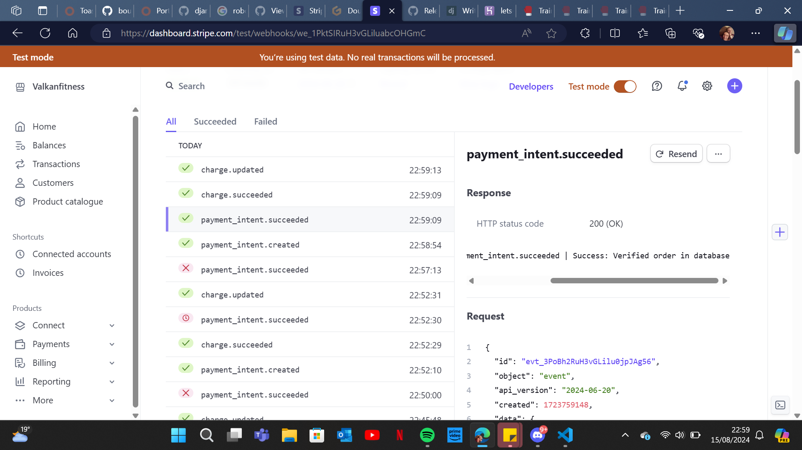
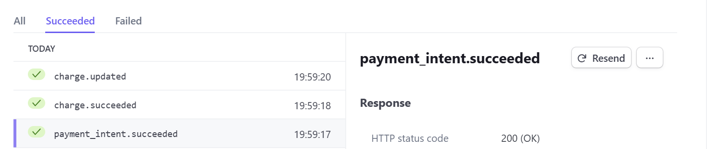

# Welcome To Valkan Fitness
Link To Website
[live site](https://lets-get-fit-0b60a4063b7b.herokuapp.com/)

# Introduction
This project was an idea I have had for a while and now studying under coding institute I have the skills
to execute it.

This project is for people looking into starting to get fit and learn more about fitness. My aim is to bring a simple and easy way to record training sessions and for Personal trainers to sell programs to clients, it also will make it easy for users to get sessions that have been planned by qualified Trainers.

##Stripe Test Integration

This project is in test mode, so no real money will be transferred.

# Scope

# UX-User Experience Design
The ideas behind the design comes from the Xbox colour scheme, the newer ones which is a darker base colour with a nice glow to appear like the on button.

Thinking about how to make it a nice experience using the app, I made the design nice and simple so that It's not over loading the user with lots of images links or other features on one page.

The UX can be broken down into
* The Strategy Plane
* The Scope Plane
* The Structure Plane
* The Skeleton Plane
* The Surface Plane

## Strategy Plane
Creator Aims:
As the creator, I want the site to be easy to navigate.
As the creator, I want to allow user to record there gym sessions.
As the creator, I want to provide users with alerts when they make actions to items one the site.
As the creator, I want to allows Staff to Add/Edit/Delete PT Sessions.

### User Stories
Client Side User Stories:
As a site user, I want the site to be inviting and simple to use.
As a site user, I want to be able to navigate across the site, so that I can view different pages on the site.
As a site user, I want to be able to sign up, so that I can have a personal account on the site.
As a site user, I want to be able to receive an email confirmation after registering.

### Customer Client Stories
As a Client, I want to be to view all products, so that I can decide what I want to buy.
As a Client, I want to be able to record my sessions to see progression.
As a Client, I want to be able to see a confirmation page and see the product in my account.
As a Client, I want to be able to view my basket, so that I can see what is in my basket and adjust quantities.

### The Scope Plane
The features that I had thought about when planning this project couldn't be made in the time I had planned, but I Could get a functional Site with the main components of the plan.

My plan for a phased deployment,

#### Phase 1

* A project that would satisfy my user stories.
* Home Page with an introduction
* Navbar allowing the user to navigate to different pages
* Products page allowing users to view all sessions made by the personal trainers.
* E-commerce functionality allowing the user to make purchases.
#### Phase 2

Building upon the Phase 1 project with additional features.
A functional Profile app that allows users to have account that link to purchase and programs made.
Allow users to build their own programs.
#### Phase 3

My final planned phase would focus on user feedback
Review feedback gathered to understand what can be improved.

## The Structure Plane
#008000

I used this green because it was close to the Xbox colour green on the consoles when turning on and i choose green because combined with a box shadow it gives a nice glow effect.
#778899

I Chose this grey because it is still bright and dose just the right amount of contrast with the other colours so it makes the others stand out.

#fff
This White was chosen to make sure the writing on it would stick out and make it easy to read.

#### Fonts - Verdana

I chose Verdana as my font throughout the project. The font is easily readable and simple. I opted to have a single font in this project simply because the project as a whole is not text-heavy, and chose to instead use a heavier font weight for headings.

#### Images
the images I chose for the website were gym based, so the banner has a dumbbell in it and the three sessions on the home page are just sessions made in Canva.

Database Design
SQLElephant was used during development.

Database Diagram
Data base plan

#### Key Models
##### Profile 

The user profile is connected to the User model created by Allauth on registration.
This lets all users have pt sessions and user programs linked to their account.

##### Orders

The order model is connected to the User Profile, allows the user to view their previous orders.
The order model acts as a container for the order line items. Although is the item is stored within the OrderLineProducts model, having them connected allows to retrieve the item purchased.

##### PT Sessions

This model is how the pt session are made and make it easy to store on the database.
It also has summer notes added to the admin page, so the trainer can customise the programs to look more professional.
##### User Programs 

User Programs are made up of two models the main session to hold the user and the clients for the session and the model contained in it is the exercise model that lets you make single exercises with reps, sets and comments.

## The Skeleton Plane

### Plans

### Thoughts 
this is a basic model i set up thinking that it would be nice to be able to edit for super users but i thought if i keep it to only one and make it so only developers and the client can change.

i also made it so its crud function is only to be updated so its easy to track and make sure not to much writing is on the home.

# Features
## Home Page

## User Sessions

### js issues
this issues has been the hardest one so far the image below shows the debugging i was using the console logs where my best friend.

I realised the for loop wasn't correct on the HTML.

this is the change I had to do to make sure it worked 

this shows that it wasn't collecting to delete number to add to the URL.

### Brief description
the aim for this page was so that customers can make up their own sessions and record what they have done.

### Plans

### Thoughts 
when making this i spent a long time trying to get the crud function to work on the exercise part because the urls and the java script just weren't working together well but its a great learning curve and will increase my skills by a lot.
### Test
The Tests i did manually : 
1. add new program

Session Added

2. View Full Session
this view shows that the link on the session open up to the exercise page

3. add Exercises 
This image shows the form to add a program to the exercise page 

4. Edit Session
this shows the editing form for the exercise and auto fills with the old information.

this shows that after editing it dose update the exercise.

5. Delete Exercise

# Pt sessions

### Brief description
This app is for the Pts/admins so they can sell their training sessions and maintain the updates for the clients so they will always have new sessions and learn new ways to try all the time.
### Staff Permissions
Staff permissions will be set by a admin when they are hired to join our team

### issues

when trying to debug i couldn't understand why it wasn't adding anything but!!!

then i was reviewing the walkthrough i saw they have the "+= 1" and thought, that makes sense how can you add nothing to nothing and then boom it worked.
### Testing
The Tests i did where 
1. Add Item To Basket
2. Test Link to the full Session Page

## Staff help with Html 

### Example for table in html

Warm Up

any Cardio For 10 mins

Table All Exercises you Should Struggle on the last one.

<table class="table table-bordered">
<thead>
<tr>
<td>Chest</td>
<td>Exercise Name</td>
<td>Reps</td>
<td>Sets</td>
</tr>
</thead>
<tbody>
<tr>
<td>Bench Press</td>
<td>3</td>
<td>10</td>
</tr>
<tr>
<td>Cable Flys</td>
<td>3</td>
<td>10</td>
</tr>
</tbody>
</table>

### Other Tools For Non Html

the bar at the top of the program part will help make good looking sessions

# Basket

### Brief description
this app is designed to be for all clients looking to by any sessions the PT/Admins make. it also only keeps the clients items when they keep the page open.
### issues
the only issue I got was the basket would not delete the product from the basket but would set it to 0
Solution: it was in the view I has not set the value to 1 it was by default 0 so it wouldn't pop it.

# Payments

### Brief description
this app is to help integrate stripe and make it easier for the users to know exactly what items they are buying 
### Issues
1. 

the main issues i had was the web hooks not working properly.

this was done when making this part of the readme.
2. 

this is the second issue that I had this isn't a big issue but it dose not stick to the norm.

# Key Words/SCO

## main subjects

* Gym Sessions

* Programs 

* Training

## Short Tail Key Words:
~ Fitness ~
Training 
~ Muscles ~
Exercises
Personal Training
~ Chest ~
~ Back ~
~ Legs ~
~ Biceps ~
~ Triceps ~
~ Full Body ~
Hit Training
Health
Goals
Sessions
weight loss
cutting weight
~ lose weight ~
~gym~ 

Long tail Key Words:

~Personal Training Sessions~
Custom-made sessions and free recording of sessions
many Different styles of training e.g Hit, Full Body and Steady State
Sessions for any needs or goals 
~buy personal training sessions~
record my gym program

## All Key Words That Will Be On The Site:

Custom-made sessions and free recording of sessions
many Different styles of training e.g Hit, Full Body and Steady State
Sessions for any needs or goals 
Record My Gym Program
Hit Training
Health
Goals
Sessions
weight loss
cutting weight
Exercises
Personal Training

# Facebook Page

### Why Use Facebook

Facebook is an amazing site to get free and paid avertisement. Facebook also has great instagram integration so you can boost on face book as well as instagram,whats app and share links on other social media site.

# Gitpod Reminders

To run a frontend (HTML, CSS, Javascript only) application in Gitpod, in the terminal, type:

`python3 -m http.server`

A blue button should appear to click: _Make Public_,

Another blue button should appear to click: _Open Browser_.

To run a backend Python file, type `python3 app.py` if your Python file is named `app.py`, of course.

A blue button should appear to click: _Make Public_,

Another blue button should appear to click: _Open Browser_.

By Default, Gitpod gives you superuser security privileges. Therefore, you do not need to use the `sudo` (superuser do) command in the bash terminal in any of the lessons.

To log into the Heroku tool belt CLI:

1. Log in to your Heroku account and go to *Account Settings* in the menu under your avatar.
2. Scroll down to the *API Key* and click *Reveal*
3. Copy the key
4. In Gitpod, from the terminal, run `heroku_config`
5. Paste in your API key when asked

You can now use the `heroku` CLI program - try running `heroku apps` to confirm it works. This API key is unique and private to you, so do not share it. If you accidentally make it public, you can create a new one with _Regenerate API Key_.

## Testing And Validation 
[Link To Testing](MANUAL_TESTS.md)

# Technology Used

## Tools 
* Django – The framework used in this project to join the databases with a website.
* Crispy Forms – Formats the models into forms on webpages.
* Gitpod – Used as the development environment.
* GitHub – The project’s Version Control.
* Heroku – To deploy the webpage.
* git commits - I used this to help word and set out my commits
* jQuery - To conduct some of the form and stripe checkout logic

## Database
* SQLite - The default database on Django.
* ElephantSQL – The final database used for the deployed project.

## Styling
* Bootstrap – To provide extra styling and positioning.
* Font Awesome – For the icons and symbols.

## Validation
* [W3C HTML Validation Service](https://validator.w3.org/ "W3C HTML") – To validate all the HTML files, including the templates from Django itself, due to editing them.
* [W3C CSS Validation Service](https://jigsaw.w3.org/css-validator/ "W3C CSS") – To validate the base.css and the admin page.
* [Python Validation](https://pep8ci.herokuapp.com/ "Python Syntax Checker PEP8") – To validate all the Python files, making sure they align with PEP8.
* [Lighthouse](https://chrome.google.com/webstore/detail/lighthouse/blipmdconlkpinefehnmjammfjpmpbjk?hl=en "Lighthouse") – To check the website’s performance and accessibility, making sure the best practices are used.

# Heroku Deployment

1. Go back to Heroku and when the Project’s page opens up, go to the "settings" tab and scroll down to the “Config Vars” section.
2. Add all relevant following key-value pairs in the “Config Vars” section. Examples include:
3. Key = SECRET_KEY : Value = Django Secret Key value obtained from settings.py
4. Key = DATABASE_URL : Value = ElephantSQL URL from point 5. As well as all the relevant stripe and AWS values.
5. Go to the “Deploy” tab next and scroll down to the GitHub deployment method.
6. Search for the suitable repository and then connect to it by selecting the “Connect” button.
7. Scroll down to the bottom of the “Deploy” Page and select the type of deployment you want to conduct
8. If you opt to “Automatically Deploy”, it will deploy every time you push new code to your repository
9. Otherwise, you will have to manually deploy, by selecting the button at the bottom of the page.
The application is now deployed!