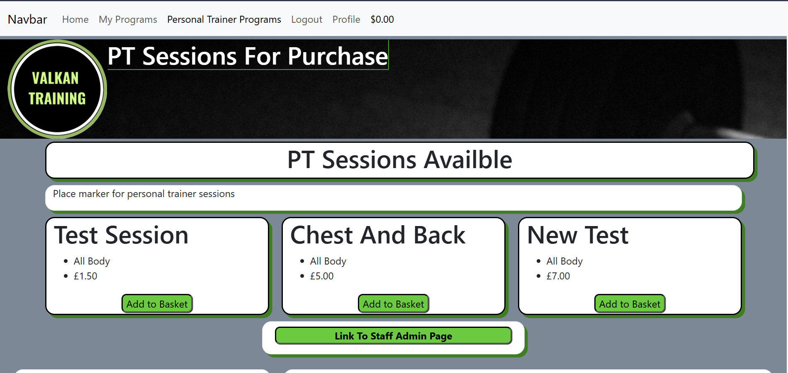
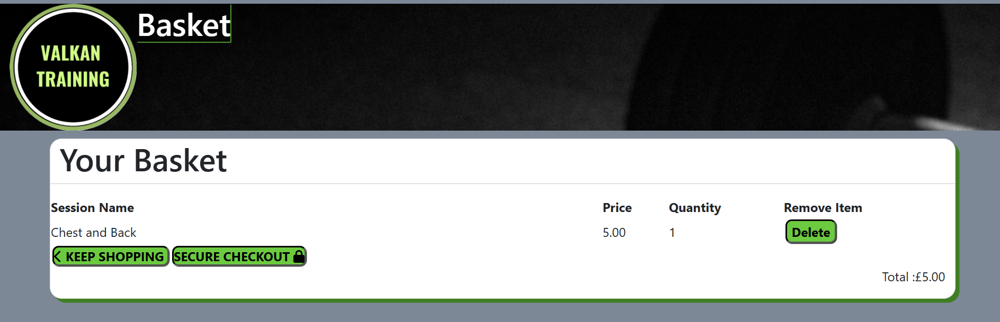

Welcome Aaron storey,
# Home Page

### Brief description
the home page is aimed to welcome new people to the app/site so they understand what we as the developers can provide the user.

# Scope

### Plans

### Thoughts 
this is a basic model i set up thinking that it would be nice to be able to edit for super users but i thought if i keep it to only one and make it so only developers and the client can change.

i also made it so its crud function is only to be updated so its easy to track and make sure not to much writing is on the home.

# issues
1. the first issue i has was getting the static files to work on the deployed version. 
is would have the bootstrap styles but no css, js or media I had made. 
* Solution
I forgot to download and set up whitenoise to the middle ware   

MIDDLEWARE = [
    'django.middleware.security.SecurityMiddleware',
#   'whitenoise.middleware.WhiteNoiseMiddleware', 
    'django.contrib.sessions.middleware.SessionMiddleware',
    'django.middleware.common.CommonMiddleware',
    'django.middleware.csrf.CsrfViewMiddleware',
    'django.contrib.auth.middleware.AuthenticationMiddleware',
    'django.contrib.messages.middleware.MessageMiddleware',
    'django.middleware.clickjacking.XFrameOptionsMiddleware',
    "allauth.account.middleware.AccountMiddleware",
]

2. update / edit the new story
*  I had an issue with getting the news story to update so i had to do some research and the problem was i had the urls set up wrong so it was using the wrong views function

>Urls.py
path('sv/', views.showView, name='show_url'),

>views.py

def updateView(request, ids):
    queryset =  get_object_or_404 (HomeNews, id=ids)
    form = NewsForm(instance=queryset)
    if request.method == 'POST':
        form = NewsForm(request.POST, instance=queryset)
        if form.is_valid():
            form.save()
#            return redirect('home')
        else:
            form = NewsForm(instance=queryset)
    template_name = 'home/crud.html'
    return render(request, template_name, {'form':form})

instead of having the redirect to home it was using the show View one and this confused me going through and wondering why the form didn't appear

# User Sessions

### js issues
this issues has been the hardest one so far the image below shows the debugging i was using the console logs where my best friend.

I realised the for loop wasn't correct on the html.

this is the change i had to do to make sure it worked 

this shows that it wasn't collecting the delete number to add to the url.

### Brief description
the aim for this page was so that customers can make up there own sessions and record what they have done.

### Plans

### Thoughts 
when making this i spent a long time trying to get the crud function to work on the exercise part because the urls and the java script just weren't working together well but its a great learning curve and will increase my skills by a lot.
### Test
The Tests i did manually : 
1. add new program

Session Added

2. View Full Session
this view shows that the link on the session open up to the exercise page

3. add Exercises 
This image shows the form to add a program to the exercise page 

4. Edit Session
this shows the editing form for the exercise and auto fills with the old information.

this shows that after editing it dose update the exercise.

5. Delete Exercise

# Pt sessions

### Brief description
This app is for the Pts/admins so they can sell their training sessions and maintain the updates for the clients so they will always have new sessions and learn new ways to try all the time.
### issues

when trying to debug i couldn't understand why it wasn't adding anything but!!!

then i was reviewing the walkthrough i saw they have the "+= 1" and thought, that makes sense how can you add nothing to nothing and then boom it worked.
### Testing
The Tests i did where 
1. Add Item To Basket
2. Test Link to the full Session Page
### Staff/Personal Trainers options

the Staff/Personal Trainers will all have access to a restricted version of the admin page.
the styles on this page is very basic because the customers wont be able to view it so all it needs to be is functional and thats what this image blow shows:

this gives staff the option to make programs up and if they know html they can us that to make a more
advanced looking program.
##### Staff help with Html  

### Example for table in html

Warm Up

any Cardio For 10 mins

Table All Exercises you Should Struggle on the last one.

<table class="table table-bordered">
<thead>
<tr>
<td>Chest</td>
<td>Exercise Name</td>
<td>Reps</td>
<td>Sets</td>
</tr>
</thead>
<tbody>
<tr>
<td>Bench Press</td>
<td>3</td>
<td>10</td>
</tr>
<tr>
<td>Cable Flys</td>
<td>3</td>
<td>10</td>
</tr>
</tbody>
</table>

### Other Tools For Non Html

the bar at the top of the program part will help make good looking sessions

# Basket

### Brief description
this app is designed to be for all clients looking to by any sessions the PT/Admins make. it also only keeps the clients items when they keep the page open.
### issues
the only issue I got was the basket would not delete the product from the basket but would set it to 0
Solution: it was in the view I has not set the value to 1 it was by default 0 so it wouldn't pop it.

# Payments

### Brief description
this app is to help integrate stripe and make it easier for the users to know exactly what items they are buying 
### Issues
1. 

the main issues i had was the web hooks not working properly.

this was done when making this part of the readme.
2. 

this is the second issue that I had this isn't a big issue but it dose not stick to the norm.

# Key Words/SCO

## main subjects

* Gym Sessions

* Programs 

* Training

## Short Tail Key Words:
~ Fitness ~
Training 
~ Muscles ~
Exercises
Personal Training
~ Chest ~
~ Back ~
~ Legs ~
~ Biceps ~
~ Triceps ~
~ Full Body ~
Hit Training
Health
Goals
Sessions
weight loss
cutting weight
~ lose weight ~
~gym~ 

Long tail Key Words:

~Personal Training Sessions~
Custom-made sessions and free recording of sessions
many Different styles of training e.g Hit, Full Body and Steady State
Sessions for any needs or goals 
~buy personal training sessions~
record my gym program

## All Key Words That Will Be On The Site:

Custom-made sessions and free recording of sessions
many Different styles of training e.g Hit, Full Body and Steady State
Sessions for any needs or goals 
Record My Gym Program
Hit Training
Health
Goals
Sessions
weight loss
cutting weight
Exercises
Personal Training

# Facebook Page

### Why Use Facebook

Facebook is an amazing site to get free and paid avertisement. Facebook also has great instagram integration so you can boost on face book as well as instagram,whats app and share links on other social media site.

# Gitpod Reminders

To run a frontend (HTML, CSS, Javascript only) application in Gitpod, in the terminal, type:

`python3 -m http.server`

A blue button should appear to click: _Make Public_,

Another blue button should appear to click: _Open Browser_.

To run a backend Python file, type `python3 app.py` if your Python file is named `app.py`, of course.

A blue button should appear to click: _Make Public_,

Another blue button should appear to click: _Open Browser_.

By Default, Gitpod gives you superuser security privileges. Therefore, you do not need to use the `sudo` (superuser do) command in the bash terminal in any of the lessons.

To log into the Heroku tool belt CLI:

1. Log in to your Heroku account and go to *Account Settings* in the menu under your avatar.
2. Scroll down to the *API Key* and click *Reveal*
3. Copy the key
4. In Gitpod, from the terminal, run `heroku_config`
5. Paste in your API key when asked

You can now use the `heroku` CLI program - try running `heroku apps` to confirm it works. This API key is unique and private to you, so do not share it. If you accidentally make it public, you can create a new one with _Regenerate API Key_.

## Testing And Validation 
[Link To Testing](MANUAL_TESTS.md)

# Technology Used

## Tools 
* Django – The framework used in this project to join the databases with a website.
* Crispy Forms – Formats the models into forms on webpages.
* Gitpod – Used as the development environment.
* GitHub – The project’s Version Control.
* Heroku – To deploy the webpage.
* git commits - I used this to help word and set out my commits

## Styling
* Bootstrap – To provide extra styling and positioning.
* Font Awesome – For the icons and symbols.

## Validation
* [W3C HTML Validation Service](https://validator.w3.org/ "W3C HTML") – To validate all the HTML files, including the templates from Django itself, due to editing them.
* [W3C CSS Validation Service](https://jigsaw.w3.org/css-validator/ "W3C CSS") – To validate the base.css and the admin page.
* [Python Validation](https://www.codewof.co.nz/style/python3/ "Python Syntax Checker PEP8") – To validate all the Python files, making sure they align with PEP8.
* [Web AIM](https://webaim.org/resources/contrastchecker/ "Web AIM") – To analyse the colour contrast properties between colours.
* [Lighthouse](https://chrome.google.com/webstore/detail/lighthouse/blipmdconlkpinefehnmjammfjpmpbjk?hl=en "Lighthouse") – To check the website’s performance and accessibility, making sure the best practices are used.

# Heroku Deployment

1. Go back to Heroku and when the Project’s page opens up, go to the "settings" tab and scroll down to the “Config Vars” section.
2. Add all relevant following key-value pairs in the “Config Vars” section. Examples include:
3. Key = SECRET_KEY : Value = Django Secret Key value obtained from settings.py
4. Key = DATABASE_URL : Value = ElephantSQL URL from point 5. As well as all the relevant stripe and AWS values.
5. Go to the “Deploy” tab next and scroll down to the GitHub deployment method.
6. Search for the suitable repository and then connect to it by selecting the “Connect” button.
7. Scroll down to the bottom of the “Deploy” Page and select the type of deployment you want to conduct
8. If you opt to “Automatically Deploy”, it will deploy every time you push new code to your repository
9. Otherwise, you will have to manually deploy, by selecting the button at the bottom of the page.
The application is now deployed!